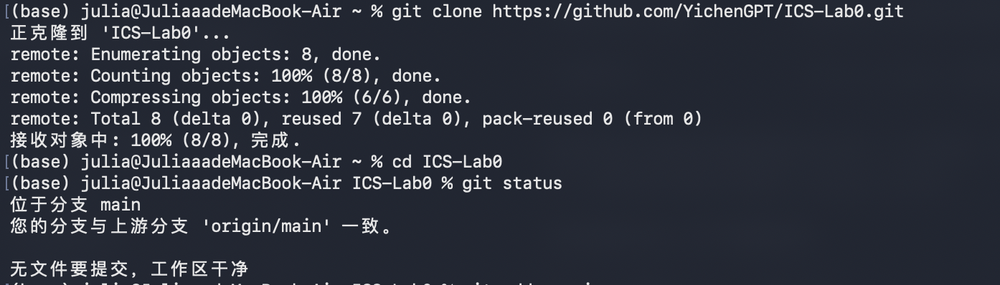
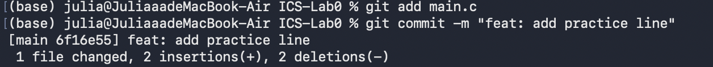
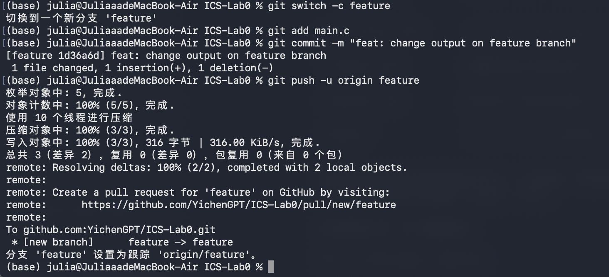
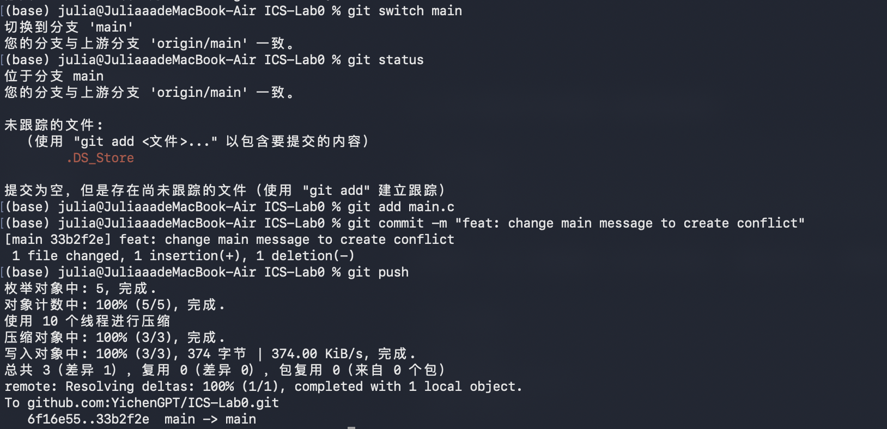
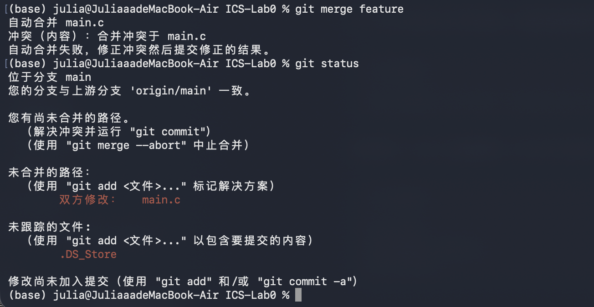
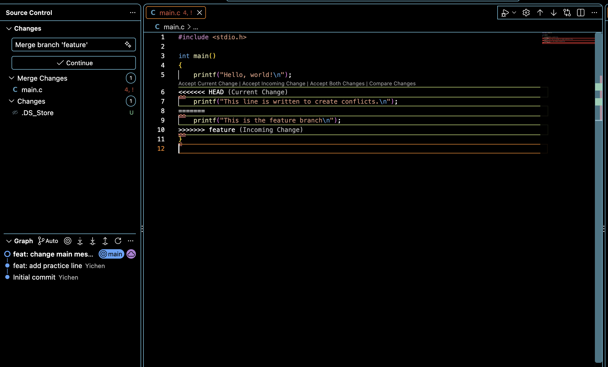
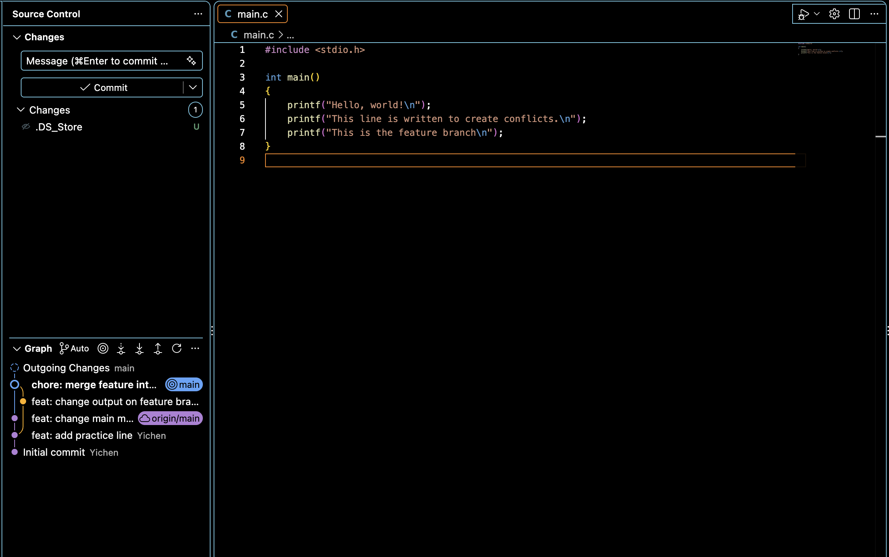
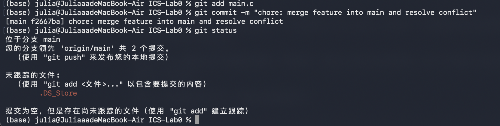

# Lab 0：Git 与 GitHub 实验报告

## 一、实验目的与完成情况

本实验通过一个 C 程序的版本管理，练习从模板创建仓库、克隆、暂存、提交、推送、创建与切换分支，以及合并冲突的分析和解决。我重点理解了工作区、暂存区、本地仓库和远程仓库之间的区别，并通过实际提交历史验证了不同分支可以独立演进、再合并到同一条开发历史中。

| 实验内容 | 结果与证据 |
| --- | --- |
| 使用课程模板创建个人仓库并克隆 | 已完成，见图 1 |
| 修改 `main.c` 的 TODO 并提交 | 已完成，提交 `6f16e55`，见图 2 |
| 在 `feature` 与 `main` 分别修改并提交 | 已完成，提交分别为 `1d36a6d`、`33b2f2e`，见图 3、图 4 |
| 合并时产生真实冲突并解决 | 已完成，合并提交 `f2667ba`，见图 5—图 8 |
| 回答文档问题 | 见第二部分 |
| 阅读两篇指定材料并概括、思考 | 见第四部分 |

## 二、文档问题回答

### 2.1 是否有过多人协同开发经历？如何分工协作？

此前我没有过多人协同开发的经历。

### 2.2 Git 为什么设计“暂存—提交”两个步骤？

我认为这两个步骤是用于分别解决“选择哪些修改”和“把这些修改记录成一个版本”的问题。

工作区保存正在编辑的文件；暂存区记录下一次提交准备采用的内容；`git commit` 则把暂存区中的内容记录为一个版本。因此，即使同时修改了多个文件，也可以按功能或目的拆成不同的提交，让每次提交更容易理解和审查。如果暂存之后又编辑文件，新改的部分还需要再次暂存才会进入提交。

本实验中，我曾输入 `git add . main.c`。其中 `.` 已经覆盖当前目录下可暂存的修改，因此除了代码，还把 macOS 生成的 `.DS_Store` 加入了暂存区。我用下面的命令取消了它的暂存：

```bash
git restore --staged .DS_Store
```

之后只提交 `main.c`。这个例子说明，暂存区提供了提交前选择和调整内容的机会；取消暂存也不等于删除文件或丢弃工作区修改。

### 2.3 `git branch` 与 `git branch -a` 的区别是什么？

`git branch`: 查看本地电脑上的分支。
`git branch -a`: 除了本地分支，还可以查看电脑记录的 GitHub 分支信息。

当前分支前有 `*` 标记。下面是本实验整理报告时的实际状态：

```text
$ git branch
  feature
* main

$ git branch -a
  feature
* main
  remotes/origin/HEAD -> origin/main
  remotes/origin/feature
  remotes/origin/main
```

其中，`feature` 是本地分支，`origin/feature` 是本地记录的远程分支位置；`origin/HEAD -> origin/main` 表示本地保存的远程默认分支指向。`git branch -a` 本身不会联网更新这些信息，必要时需先 `git fetch origin`。此外，带名称的 `git branch feature` 是创建分支，并不会自动切换；`git switch -c feature` 则同时创建并切换。[Git branch 官方文档](https://git-scm.com/docs/git-branch)

## 三、实验步骤与结果

### 3.1 从模板创建仓库并克隆

在课程提供的 `ICS-26Fall-FDU/GitLab` 模板仓库中使用 **Use this template**，创建个人的 `YichenGPT/ICS-Lab0` 仓库。随后在终端执行：

```bash
git clone https://github.com/YichenGPT/ICS-Lab0.git
cd ICS-Lab0
git status
```

克隆后位于 `main` 分支，本地与 `origin/main` 一致，工作区没有修改。克隆得到的文件夹已经是 Git 仓库，不需要再次执行 `git init`。



### 3.2 完成 TODO 并创建第一次提交

在 `main.c` 中删除 TODO 注释，保留原来的 Hello world 输出，并新增：

```c
printf("This is a practice code.\n");
```

保存文件后执行：

```bash
git add main.c
git commit -m "feat: add practice line"
```

生成提交 `6f16e55`。截图中显示完成 TODO 后的首次提交。



### 3.3 在 `feature` 分支修改并提交

从提交 `6f16e55` 创建并切换到新分支：

```bash
git switch -c feature
```

此时两个分支共享此前的提交历史。随后把第二条输出替换为：

```c
printf("This is the feature branch\n");
```

保存并提交，再把该分支推送到远程：

```bash
git add main.c
git commit -m "feat: change output on feature branch"
git push -u origin feature
```

生成提交 `1d36a6d`，并建立本地 `feature` 对 `origin/feature` 的跟踪关系。截图显示：创建 feature 分支、提交修改并推送。



### 3.4 在 `main` 分支修改同一行并提交

执行 `git switch main` 后，`main.c` 回到 `main` 所对应的版本。我把同一条输出改为另一段文字：

```c
printf("This line is written to create conflicts.\n");
```
截图中显示：main 分支上的独立修改与提交，修改的地方为同一处，会造成 merge conflict: 



### 3.5 尝试合并，观察并解释冲突

在 `main` 分支执行：

```bash
git merge feature
git status
```

Git 报告 `main.c` 发生内容冲突，自动合并未完成；`git status` 显示存在尚未合并的路径，并将 `main.c` 标记为“双方修改”。




冲突的原因是本次修改作用于共同版本中的同一行，且两边给出的替换内容不同。

编辑器中出现以下冲突块：

```text
<<<<<<< HEAD
    printf("This line is written to create conflicts.\n");
=======
    printf("This is the feature branch\n");
>>>>>>> feature
```

在这次合并中，`HEAD` 一侧是当前 `main` 的内容，另一侧来自 `feature`；中间的分隔线把两种候选内容分开。




### 3.6 解决冲突并完成合并提交

比较两边代码后决定同时保留两句输出：两句分别说明不同分支的修改，都是独立的 `printf` 调用，因此选择 **Accept Both Changes**，确认冲突标记已被移除，并保存文件。

最终 `main.c` 为：

```c
#include <stdio.h>

int main()
{
    printf("Hello, world!\n");
    printf("This line is written to create conflicts.\n");
    printf("This is the feature branch\n");
}
```

生成合并，推送前状态如图: 

在 terminal 中进行暂存(并最终推送): 



## 四、指定材料阅读与思考

### 4.1 Commit Message 规范

阅读材料：[阮一峰《Commit message 和 Change log 编写指南》](https://www.ruanyifeng.com/blog/2016/01/commit_message_change_log.html)。

该材料介绍用类型、可选范围和简短描述组织提交标题，并在需要时补充正文与尾注。统一格式可以帮助检索历史、理解修改目的及生成更新日志；工具可以辅助填写和检查，但不替代对修改内容的判断。

结合本实验，我为新增输出使用了 `feat`，Eg: `feat: add practice line`，合并提交使用的 `chore`；与“update” 相比，该书写方式的说明能够直接区分增加输出、分支修改和解决冲突。

### 4.2 Git Flow 分支控制

阅读材料：[Dafay《Gitflow 使用规范》](https://www.dafaycoding.com/article/git-gif-flow)。

该文章介绍: `master` 保存稳定发布版本，`develop` 汇集开发成果；`feature` 用于功能开发，`release` 用于发布准备，`hotfix` 用于紧急修复。

Git Flow 体现了先独立修改、再集中整合的思想。约定分支来源和合入目标，可以使多人工作与版本发布更有秩序。

### 4.3 “为什么要学习 Git”的理解

通过这次实验，我认为学习 Git 的价值主要体现在三个方面。

首先，Git 把修改记录为可追溯的历史。无需依赖不断复制“最终版”“最终版 2”等文件，也能比较前后差异、查看修改原因，并在需要时查找过去的版本。

其次，Git 让尝试修改更有组织。本实验中，`feature` 上提交的新内容没有直接推进 `main`；两个分支可以各自修改，再通过合并形成最终结果。

最后，Git 与 GitHub 配合可以让成果被他人更方便地理解、审查与修改。本地提交只在本机记录，推送后协作者才能查看远程历史。清楚的提交说明、保留的合并历史以及 README.md 等有助于其他开发者或者协作者高效理解、审阅和修改代码，这远优于仅交出一个单独的代码文件。
